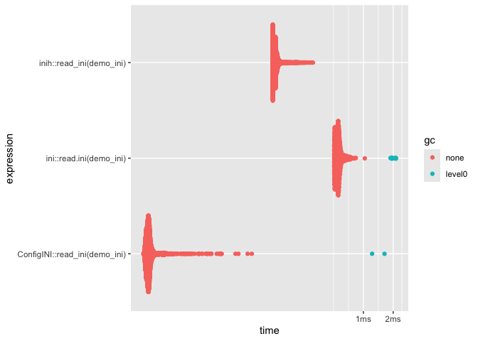

# ConfigINI

<!-- badges: start -->

[](https://CRAN.R-project.org/package=ConfigINI)
[](https://app.codecov.io/gh/DyfanJones/ConfigINI)
[](https://dyfanjones.r-universe.dev/ConfigINI)
<!-- badges: end -->

Oringially developed with the paws.common package. A Fast INI Parser for
R using Rcpp.

## Installation

You can install the development version of ConfigINI like so:

Github:

``` r
remotes::install_github("dyfanjones/ConfigINI")
```

r-universe:

``` r
install.packages("ConfigINI", repos = c("https://dyfanjones.r-universe.dev", "https://cloud.r-project.org"))
```

## Example

This is a basic example which shows you how to solve a common problem:

### Read:

``` r
library(ConfigINI)

demo_ini <- system.file("demo.ini", package = "ConfigINI")
read_ini(demo_ini)
#> $job
#> $job$company
#> [1] "ExampleCorp"
#> 
#> $job$title
#> [1] "Engineer"
#> 
#> 
#> $person
#> $person$age
#> [1] "30"
#> 
#> $person$city
#> [1] "New York"
#> 
#> $person$name
#> [1] "John Doe"
#> 
#> $person$userId
#> [1] "123456"
```

ConfigINI is also capible of reading some nested key value pairs:

``` r
nested_ini <- system.file("nested.ini", package = "ConfigINI")
cat(readLines(nested_ini), sep = "\n")
#> [foo]
#> arg1=foo_value1
#> arg2=foo_value2
#> 
#> [bar]
#> nested1 =
#>   arg1 = value1
#>   arg2 = value2
#> arg3 = value3
#> nested2 =
#>   arg4 = value4
```

The current ini package doesn’t support this feature and instead will
flatten out the nested key value pairs:

``` r
ini::read.ini(nested_ini)
#> $foo
#> $foo$arg1
#> [1] "foo_value1"
#> 
#> $foo$arg2
#> [1] "foo_value2"
#> 
#> 
#> $bar
#> $bar$arg1
#> [1] "value1"
#> 
#> $bar$arg2
#> [1] "value2"
#> 
#> $bar$arg3
#> [1] "value3"
#> 
#> $bar$arg4
#> [1] "value4"
```

The ConfigINI package will keep the nested key value pairs:

``` r
ConfigINI::read_ini(nested_ini)
#> $foo
#> $foo$arg1
#> [1] "foo_value1"
#> 
#> $foo$arg2
#> [1] "foo_value2"
#> 
#> 
#> $bar
#> $bar$nested1
#> $bar$nested1$arg1
#> [1] "value1"
#> 
#> $bar$nested1$arg2
#> [1] "value2"
#> 
#> 
#> $bar$arg3
#> [1] "value3"
#> 
#> $bar$nested2
#> $bar$nested2$arg4
#> [1] "value4"
```

### Write:

``` r
library(ConfigINI)

temp_file <- tempfile(fileext = ".ini")
# Create an example configuration list
config <- list(
  person = list(name = "John Doe", age = "30", city = "New York"),
  job = list(title = "Engineer", company = "ExampleCorp")
)

# Write the configuration to an INI file
write_ini(config, temp_file)

# Check the content of the created INI file
cat(readLines(temp_file), sep = "\n")
#> [job]
#> company = ExampleCorp
#> title = Engineer
#> 
#> [person]
#> age = 30
#> city = New York
#> name = John Doe

# clean up
unlink(temp_file)
```

## Benchmark:

Finally ConfigINI is faster than the other INI parsers available in R
(to my knowledge) :)

``` r
# get inih from r-universe for benchmark
install.packages("inih", repos = c("https://dyfanjones.r-universe.dev", "https://cloud.r-project.org"))
```

``` r
demo_ini <- system.file("demo.ini", package = "ConfigINI")
(bm <- bench::mark(
  ConfigINI::read_ini(demo_ini),
  inih::read_ini(demo_ini),
  ini::read.ini(demo_ini),
  relative = TRUE
))
#> # A tibble: 3 × 6
#>   expression                      min median `itr/sec` mem_alloc `gc/sec`
#>   <bch:expr>                    <dbl>  <dbl>     <dbl>     <dbl>    <dbl>
#> 1 ConfigINI::read_ini(demo_ini)  1      1        10.2        NaN     8.16
#> 2 inih::read_ini(demo_ini)       2.57   2.46      4.29       Inf     1   
#> 3 ini::read.ini(demo_ini)       10.8   10.6       1          Inf     8.35

ggplot2::autoplot(bm)
#> Loading required namespace: tidyr
```


